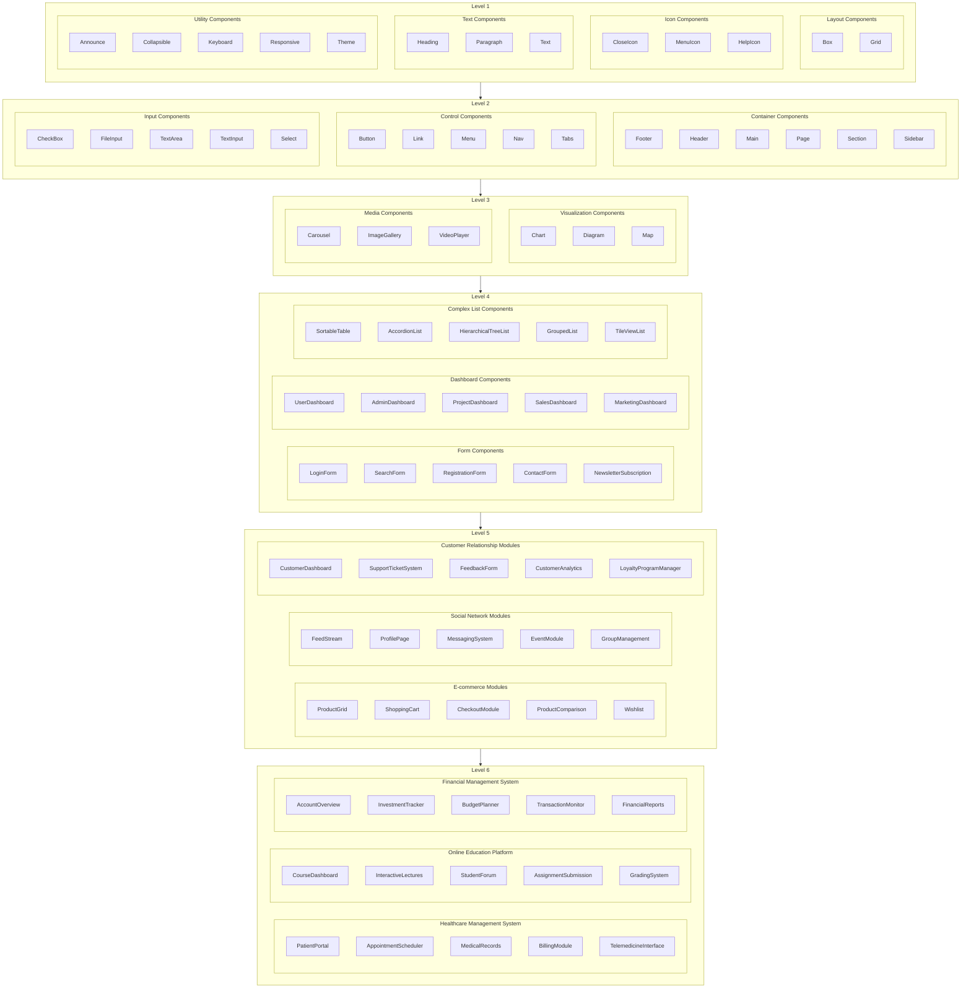

# Component Hierarchy

## Descriptions

### Level 1: Basic UI Components

- **Description**: This level consists of the fundamental building blocks for any web application. Components are typically individual UI elements that serve singular purposes and are frequently reused.
- **Examples**: Boxes, Grids, Icons (like Close, Menu, Help), and basic Text components (Headings, Paragraphs).

### Level 2: Grouped UI Components

- **Description**: Components at this level start to combine basic elements from Level 1 into grouped units that serve more specific functions within a user interface.
- **Examples**: Container components such as Footers, Headers, and Sidebars, as well as Control components like Buttons and Navigation bars.

### Level 3: Functional Components

- **Description**: This level features components that provide specific functionality and are often dependent on integrating multiple simpler components from Levels 1 and 2.
- **Examples**: Visualization tools like Charts and Maps, and Media components such as Carousels and Video Players.

### Level 4: Composite Interface Components

- **Description**: Components here are more complex and integrate functionalities from the first three levels to form parts of an application that handle more elaborate user interactions.
- **Examples**: Forms (like Login and Search Forms), Dashboards (such as User and Admin Dashboards), and complex list structures like Sortable Tables.

### Level 5: Application-Specific Modules

- **Description**: At this level, components are highly specialized and tailored for specific types of applications, encapsulating multiple functionalities to serve as major functional units within an app.
- **Examples**: E-commerce modules (Product Grids, Shopping Carts), Social Network modules (Feed Streams, Profile Pages), and Customer Relationship modules (Customer Dashboards, Support Ticket Systems).

### Level 6: Full Application Layouts or Complex Systems

- **Description**: The highest level of complexity, these components are comprehensive systems or complete application layouts that integrate numerous modules from Level 5 to create entire sections of an application or full standalone applications.
- **Examples**: News Portals integrating various content streams and interactive features, Online Learning Platforms combining educational content, tools, and community interaction.
