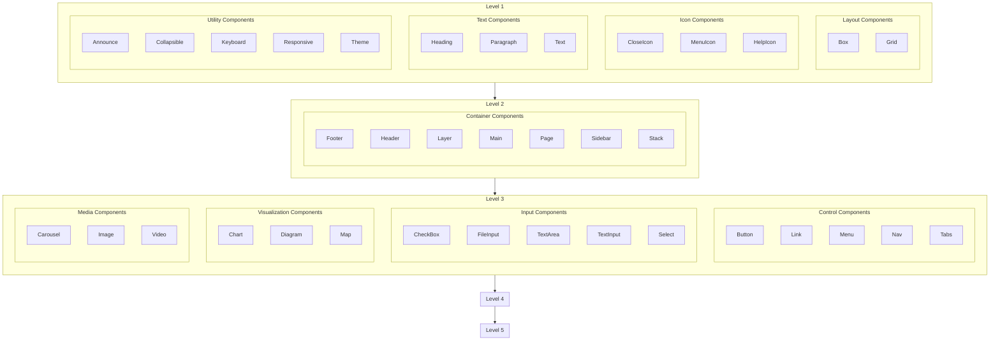

## Hierarchy

Button
Input
Modal
Dropdown
Tooltip
Form
Checkbox
RadioButton
Select
Card
Alert
Table
Tabs
Badge
Accordion
Popover
ProgressBar
Breadcrumb
Slider
Spinner
Switch
Pagination
Sidebar
Stepper
Timeline
Carousel
Grid
Flexbox
Container
Box
Stack
Spacer
Divider
AspectRatioBox
GridList
LayoutGrid
