# Composing and Decomposing User Interfaces

## Popular Sites

1. **Amazon** - A complex e-commerce platform with dense layouts. [Visit Amazon](https://www.amazon.com)
2. **Airbnb** - Features a clean, minimalist design focused on user-friendly booking. [Visit Airbnb](https://www.airbnb.com)
3. **GitHub** - Developer-oriented interface focusing on code repositories and collaboration. [Visit GitHub](https://github.com)
4. **Spotify** - Media-rich, focused on music streaming with dynamic content layouts. [Visit Spotify](https://www.spotify.com)
5. **The New York Times** - Newspaper-style layout with a focus on typography and multimedia. [Visit The New York Times](https://www.nytimes.com)
6. **Netflix** - Visual interface with a focus on video thumbnails and personalized suggestions. [Visit Netflix](https://www.netflix.com)
7. **Slack** - Designed for real-time communication, featuring sidebars and message streams. [Visit Slack](https://slack.com)
8. **Pinterest** - Uses a grid-based, card layout for displaying image-focused content. [Visit Pinterest](https://www.pinterest.com)
9. **Duolingo** - Playful, gamified interface for interactive language learning. [Visit Duolingo](https://www.duolingo.com)
10. **Tesla** - High-quality visuals in a minimalist design focusing on product showcases. [Visit Tesla](https://www.tesla.com)

## Popular Libraries

1. **Material-UI** (MUI): Provides a comprehensive suite of UI tools based on Material Design.
2. **Ant Design**: A design system for enterprise-level products, creating efficient and enjoyable UIs.
3. **Chakra UI**: A simple, modular, and accessible component library that gives you all the building blocks you need to build React applications.
4. **React Bootstrap**: Rebuilt from Bootstrap to work natively in React.
5. **Blueprint**: Primarily for building complex and data-dense interfaces for desktop applications.
6. **Semantic UI React**: The official React integration for Semantic UI.
7. **Evergreen**: By Segment, this library is suitable for enterprise-grade web applications.
8. **Rebass**: A React primitive UI components built with styled-system.
9. **Grommet**: Aims to provide a responsive and accessible mobile-first design.
10. **PrimeReact**: A rich set of open-source UI components for React.
11. **Reactstrap**: Simple Bootstrap 4 components built with React.
12. **Shards React**: A free, beautiful, and modern React UI kit based on Shards.
13. **Styled-System**: Style props for rapid UI development, which works seamlessly with component libraries.
14. **Onsen UI**: For building mobile apps with React that look and feel truly native.
15. **Fluent UI (formerly Office UI Fabric)**: For building Microsoft web experiences.
16. **Carbon Components React**: Developed by IBM, this library is based on the Carbon Design System.
17. **Elemental UI**: A flexible and beautiful UI framework for React.js.
18. **RSuite**: A suite of React components, sensible UI design, and a friendly development experience.
19. **React Toolbox**: A set of React components that implement Google's Material Design.
20. **Belle**: Configurable React components with great UX.
21. **React Virtualized**: Efficiently rendering large lists and tabular data.
22. **Polaris**: Designed by Shopify, this library helps create a great experience for merchants.
23. **Base Web**: The React component library for the "base" design system that helps build products for web.
24. **Orbit Components**: A React component library designed by Kiwi.com to build consistent UIs.
25. **KendoReact**: A professional grade UI library with 100+ components.

### Repos

1. **Material-UI (MUI)** - [GitHub](https://github.com/mui/material-ui)
2. **Ant Design** - [GitHub](https://github.com/ant-design/ant-design)
3. **Chakra UI** - [GitHub](https://github.com/chakra-ui/chakra-ui)
4. **React Bootstrap** - [GitHub](https://github.com/react-bootstrap/react-bootstrap)
5. **Blueprint** - [GitHub](https://github.com/palantir/blueprint)
6. **Semantic UI React** - [GitHub](https://github.com/Semantic-Org/Semantic-UI-React)
7. **Evergreen** - [GitHub](https://github.com/segmentio/evergreen)
8. **Rebass** - [GitHub](https://github.com/rebassjs/rebass)
9. **Grommet** - [GitHub](https://github.com/grommet/grommet)
10. **Radix UI** - [GitHub](https://github.com/radix-ui/primitives)
11. **Polaris** - [GitHub](https://github.com/Shopify/polaris-react)
12. **PrimeReact** - [GitHub](https://github.com/primefaces/primereact)
13. **Mantine** - [GitHub](https://github.com/mantinedev/mantine)
14. **Shards React** - [GitHub](https://github.com/DesignRevision/shards-react)
15. **Onsen UI** - [GitHub](https://github.com/OnsenUI/OnsenUI)
16. **RSuite** - [GitHub](https://github.com/rsuite/rsuite)
17. **Base Web** - [GitHub](https://github.com/uber/baseweb)
18. **Carbon Components React** - [GitHub](https://github.com/carbon-design-system/carbon)
19. **React Toolbox** - [GitHub](https://github.com/react-toolbox/react-toolbox)
20. **Orbit Components** - [GitHub](https://github.com/kiwicom/orbit)
21. **Elastic UI** - [GitHub](https://github.com/elastic/eui)
22. **Reactstrap** - [GitHub](https://github.com/reactstrap/reactstrap)
23. **Belle** - [GitHub](https://github.com/nikgraf/belle)
24. **React MD** - [GitHub](https://github.com/mlaursen/react-md)
25. **Ring UI** - [GitHub](https://github.com/JetBrains/ring-ui)

### Components

1. **Material-UI (MUI)** - [Components](https://github.com/mui/material-ui/tree/master/packages/mui-material/src)
2. **Ant Design** - [Components](https://github.com/ant-design/ant-design/tree/master/components)
3. **Chakra UI** - [Components](https://github.com/chakra-ui/chakra-ui/tree/main/packages/components/src)
4. **React Bootstrap** - [Components](https://github.com/react-bootstrap/react-bootstrap/tree/master/src)
5. **Blueprint** - [Components](https://github.com/palantir/blueprint/tree/develop/packages/core/src/components)
6. **Semantic UI React** - [Components](https://github.com/Semantic-Org/Semantic-UI-React/tree/master/src)
7. **Evergreen** - [Components](https://github.com/segmentio/evergreen/tree/main/src/components)
8. **Rebass** - [Components](https://github.com/rebassjs/rebass/tree/main/packages/rebass/src)
9. **Grommet** - [Components](https://github.com/grommet/grommet/tree/master/src/js/components)
10. **Radix UI** - [Components](https://github.com/radix-ui/primitives/tree/main/packages/react)
11. **Polaris** - [Components](https://github.com/Shopify/polaris-react/tree/main/src/components)
12. **PrimeReact** - [Components](https://github.com/primefaces/primereact/tree/master/src/components)
13. **Mantine** - [Components](https://github.com/mantinedev/mantine/tree/master/src/mantine-core/src/components)
14. **Shards React** - [Components](https://github.com/DesignRevision/shards-react/tree/master/src/components)
15. **Onsen UI** - [Components](https://github.com/OnsenUI/OnsenUI/tree/master/bindings/react/src/components)
16. **RSuite** - [Components](https://github.com/rsuite/rsuite/tree/master/src/components)
17. **Base Web** - [Components](https://github.com/uber/baseweb/tree/master/src)
18. **Carbon Components React** - [Components](https://github.com/carbon-design-system/carbon/tree/main/packages/react/src/components)
19. **React Toolbox** - [Components](https://github.com/react-toolbox/react-toolbox/tree/dev/components)
20. **Orbit Components** - [Components](https://github.com/kiwicom/orbit/tree/main/packages/orbit-components/src)
21. **Elastic UI** - [Components](https://github.com/elastic/eui/tree/main/src/components)
22. **Reactstrap** - [Components](https://github.com/reactstrap/reactstrap/tree/master/src)
23. **Belle** - [Components](https://github.com/nikgraf/belle/tree/master/src/components)
24. **React MD** - [Components](https://github.com/mlaursen/react-md/tree/master/packages/react-md/src/components)
25. **Ring UI** - [Components](https://github.com/JetBrains/ring-ui/tree/master/packages/ring-ui/components)

### Popular Components

#### General

1. **Button** - Triggers user interaction events (_25 libraries_)
2. **Input** - Field for user text entry (_25 libraries_)
3. **Modal** - Displays content on a foreground dialog (_24 libraries_)
4. **Dropdown** - List of options for user selection (_23 libraries_)
5. **Tooltip** - Small information popup on hover (_23 libraries_)
6. **Form** - Container for data entry fields (_23 libraries_)
7. **Checkbox** - Toggle option for selection (_22 libraries_)
8. **Radio Button** - Select one option from a set (_22 libraries_)
9. **Select** - Dropdown for selecting options (_22 libraries_)
10. **Card** - Container for related information (_21 libraries_)
11. **Alert** - Displays important messages (_21 libraries_)
12. **Table** - Organizes data in columns and rows (_20 libraries_)
13. **Tabs** - Navigation through local content sections (_20 libraries_)
14. **Badge** - Small count and status descriptor (_19 libraries_)
15. **Accordion** - Collapsible content panels (_18 libraries_)
16. **Popover** - Floats over content to show more details (_18 libraries_)
17. **Progress Bar** - Visualizes progression of a process (_17 libraries_)
18. **Breadcrumb** - Navigation aid showing user's location (_16 libraries_)
19. **Slider** - Selects a value from a range (_15 libraries_)
20. **Spinner** - Indicates loading state (_14 libraries_)
21. **Switch** - Toggles between two states (_14 libraries_)
22. **Pagination** - Navigates through pages (_13 libraries_)
23. **Sidebar** - Secondary menu or navigation area (_12 libraries_)
24. **Stepper** - Steps through a process (_10 libraries_)
25. **Timeline** - Displays a sequence of events (_9 libraries_)
26. **Carousel** - Rotates through a series of content (_9 libraries_)

#### Layout

1. **Grid** - Flexible grid system for complex layouts (_25 libraries_)
2. **Flexbox** - Controls layout using CSS flexible boxes (_25 libraries_)
3. **Container** - Centers and contains sections of content (_23 libraries_)
4. **Box** - Basic building block for spacing and alignment (_22 libraries_)
5. **Stack** - Vertically or horizontally stacks children (_20 libraries_)
6. **Spacer** - Provides space between items in a layout (_18 libraries_)
7. **Divider** - Visually separates components or groups (_17 libraries_)
8. **Aspect Ratio Box** - Maintains the aspect ratio of the child component (_15 libraries_)
9. **Grid List** - Organizes elements into a grid-like list (_12 libraries_)
10. **Layout Grid** - Advanced grid layout for precise alignment and distribution (_10 libraries_)

## Principles for creating user interfaces

1. **Component Reusability**: Build components that are reusable across different parts of the application. This reduces redundancy and helps maintain consistency.

2. **Single Responsibility**: Each component should have one responsibility and should execute it well. This simplifies debugging, testing, and maintenance.

3. **Composability**: Design components to be easily composed with other components. This flexibility allows for building complex UIs from simple building blocks.

4. **Encapsulation**: Keep component internals private as much as possible. This means managing state and behaviors within components without exposing unnecessary details to the outside.

5. **State Minimization**: Keep local state to a minimum. Lift state up only when necessary to reduce dependencies and complexity in the data flow.

6. **Clear Abstractions**: Create clear and meaningful abstractions that reflect the UI's domain. Components should be understandable and their interfaces clearly defined.

7. **Consistency**: Follow consistent naming conventions, file structures, and coding practices. This makes the code easier to read and maintain.

8. **Performance Consideration**: Be mindful of performance impacts when designing components. Avoid unnecessary re-renders and optimize data handling.

9. **Accessibility**: Ensure that UI components are accessible by default, considering keyboard navigation, screen reader support, and semantic markup.

10. **Documentation and Comments**: Document components and their interfaces thoroughly. Good documentation and inline comments can save time for others and for future you, especially when the UI complexity grows.

## Hierarchy

```mermaid
flowchart TD
Button
Input
Modal
Dropdown
Tooltip
Form
Checkbox
RadioButton
Select
Card
Alert
Table
Tabs
Badge
Accordion
Popover
ProgressBar
Breadcrumb
Slider
Spinner
Switch
Pagination
Sidebar
Stepper
Timeline
Carousel
Grid
Flexbox
Container
Box
Stack
Spacer
Divider
AspectRatioBox
GridList
LayoutGrid

Box --> Button
```

